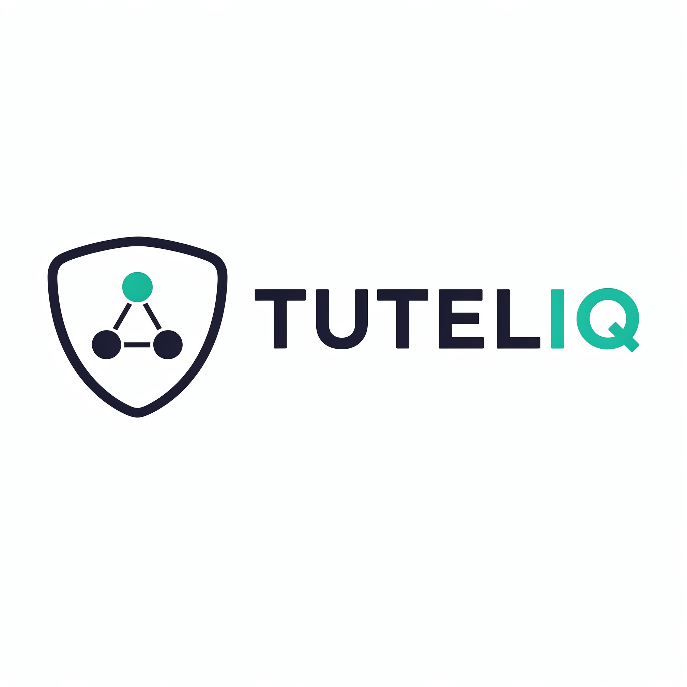

<p align="center">
  
</p>

<h1 align="center">Tuteliq Swift SDK</h1>

<p align="center">
  <strong>Official Swift SDK for the Tuteliq API</strong><br>
  AI-powered child safety analysis for iOS, macOS, tvOS, and watchOS
</p>

<p align="center">
  <a href="https://github.com/Tuteliq/swift/actions"></a>
  
  
  <a href="https://github.com/Tuteliq/swift/blob/main/LICENSE"></a>
</p>

<p align="center">
  <a href="https://api.tuteliq.ai/docs">API Docs</a> •
  <a href="https://tuteliq.app">Dashboard</a> •
  <a href="https://discord.gg/7kbTeRYRXD">Discord</a>
</p>

---

## Installation

### Swift Package Manager

Add Tuteliq to your `Package.swift`:

```swift
dependencies: [
    .package(url: "https://github.com/Tuteliq/swift.git", from: "1.0.0")
]
```

Or in Xcode: **File → Add Package Dependencies** → Enter:
```
https://github.com/Tuteliq/swift.git
```

---

## Quick Start

```swift
import Tuteliq

let tuteliq = Tuteliq(apiKey: "your-api-key")

// Quick safety analysis
let result = try await tuteliq.analyze(content: "Message to check")

if result.riskLevel != .safe {
    print("Risk: \(result.riskLevel)")
    print("Summary: \(result.summary)")
}
```

---

## API Reference

### Initialization

```swift
// Simple
let tuteliq = Tuteliq(apiKey: "your-api-key")

// With options
let tuteliq = Tuteliq(
    apiKey: "your-api-key",
    timeout: 30,      // Request timeout in seconds
    maxRetries: 3,    // Retry attempts
    retryDelay: 1     // Initial retry delay in seconds
)
```

### Bullying Detection

```swift
let result = try await tuteliq.detectBullying(
    content: "Nobody likes you, just leave"
)

if result.isBullying {
    print("Severity: \(result.severity)")      // .low, .medium, .high, .critical
    print("Types: \(result.bullyingType)")     // ["exclusion", "verbal_abuse"]
    print("Confidence: \(result.confidence)")  // 0.92
    print("Rationale: \(result.rationale)")
}
```

### Grooming Detection

```swift
let result = try await tuteliq.detectGrooming(
    DetectGroomingInput(
        messages: [
            GroomingMessage(role: .adult, content: "This is our secret"),
            GroomingMessage(role: .child, content: "Ok I won't tell")
        ],
        childAge: 12
    )
)

if result.groomingRisk == .high {
    print("Flags: \(result.flags)")  // ["secrecy", "isolation"]
}
```

### Unsafe Content Detection

```swift
let result = try await tuteliq.detectUnsafe(
    content: "I don't want to be here anymore"
)

if result.unsafe {
    print("Categories: \(result.categories)")  // ["self_harm", "crisis"]
    print("Severity: \(result.severity)")      // .critical
}
```

### Quick Analysis

Runs bullying and unsafe detection in parallel:

```swift
let result = try await tuteliq.analyze(content: "Message to check")

print("Risk Level: \(result.riskLevel)")  // .safe, .low, .medium, .high, .critical
print("Risk Score: \(result.riskScore)")  // 0.0 - 1.0
print("Summary: \(result.summary)")
print("Action: \(result.recommendedAction)")
```

### Emotion Analysis

```swift
let result = try await tuteliq.analyzeEmotions(
    content: "I'm so stressed about everything"
)

print("Emotions: \(result.dominantEmotions)")  // ["anxiety", "sadness"]
print("Trend: \(result.trend)")                // .improving, .stable, .worsening
print("Followup: \(result.recommendedFollowup)")
```

### Action Plan

```swift
let plan = try await tuteliq.getActionPlan(
    GetActionPlanInput(
        situation: "Someone is spreading rumors about me",
        childAge: 12,
        audience: .child,
        severity: .medium
    )
)

print("Steps: \(plan.steps)")
print("Tone: \(plan.tone)")
```

### Incident Report

```swift
let report = try await tuteliq.generateReport(
    GenerateReportInput(
        messages: [
            ReportMessage(sender: "user1", content: "Threatening message"),
            ReportMessage(sender: "child", content: "Please stop")
        ],
        childAge: 14
    )
)

print("Summary: \(report.summary)")
print("Risk: \(report.riskLevel)")
print("Next Steps: \(report.recommendedNextSteps)")
```

---

## Tracking Fields

All methods support `externalId` and `metadata` for correlating requests:

```swift
let result = try await tuteliq.detectBullying(
    DetectBullyingInput(
        content: "Test message",
        externalId: "msg_12345",
        metadata: ["user_id": "usr_abc", "session": "sess_xyz"]
    )
)

// Echoed back in response
print(result.externalId)  // "msg_12345"
```

---

## Usage Tracking

```swift
let result = try await tuteliq.detectBullying(content: "test")

// Access usage stats after any request
if let usage = tuteliq.usage {
    print("Limit: \(usage.limit)")
    print("Used: \(usage.used)")
    print("Remaining: \(usage.remaining)")
}

// Request metadata
print("Request ID: \(tuteliq.lastRequestId ?? "N/A")")
print("Latency: \(tuteliq.lastLatency ?? 0)s")
```

---

## Error Handling

```swift
do {
    let result = try await tuteliq.detectBullying(content: "test")
} catch let error as TuteliqError {
    switch error {
    case .authenticationError(let message):
        print("Auth error: \(message)")
    case .rateLimitError(let message):
        print("Rate limited: \(message)")
    case .validationError(let message, let details):
        print("Invalid input: \(message)")
    case .serverError(let message, let statusCode):
        print("Server error \(statusCode): \(message)")
    case .timeoutError(let message):
        print("Timeout: \(message)")
    case .networkError(let message):
        print("Network error: \(message)")
    case .unknownError(let message):
        print("Error: \(message)")
    }
}
```

---

## SwiftUI Example

```swift
import SwiftUI
import Tuteliq

struct ContentView: View {
    @State private var message = ""
    @State private var warning: String?
    @State private var isChecking = false

    let tuteliq = Tuteliq(apiKey: ProcessInfo.processInfo.environment["TUTELIQ_API_KEY"] ?? "")

    var body: some View {
        VStack {
            TextField("Message", text: $message)
                .textFieldStyle(.roundedBorder)

            if let warning = warning {
                Text(warning)
                    .foregroundColor(.red)
            }

            Button("Send") {
                Task { await checkAndSend() }
            }
            .disabled(isChecking)
        }
        .padding()
    }

    func checkAndSend() async {
        isChecking = true
        defer { isChecking = false }

        do {
            let result = try await tuteliq.analyze(content: message)

            if result.riskLevel != .safe {
                warning = result.summary
                return
            }

            // Safe to send
            warning = nil
            // ... send message
        } catch {
            warning = error.localizedDescription
        }
    }
}
```

---

## Requirements

- Swift 5.9+
- iOS 15+ / macOS 12+ / tvOS 15+ / watchOS 8+

---

## Best Practices

### Message Batching

The **bullying** and **unsafe content** methods analyze a single `text` field per request. If your app receives messages one at a time, concatenate a **sliding window of recent messages** into one string before calling the API. Single words or short fragments lack context for accurate detection and can be exploited to bypass safety filters.

```swift
// Bad — each message analyzed in isolation, easily evaded
for msg in messages {
    try await client.detectBullying(text: msg)
}

// Good — recent messages analyzed together
let window = recentMessages.suffix(10).joined(separator: " ")
try await client.detectBullying(text: window)
```

The **grooming** method already accepts a `messages` array and analyzes the full conversation in context.

### PII Redaction

Enable `PII_REDACTION_ENABLED=true` on your Tuteliq API to automatically strip emails, phone numbers, URLs, social handles, IPs, and other PII from detection summaries and webhook payloads. The original text is still analyzed in full — only stored outputs are scrubbed.

---

## Support

- **API Docs**: [api.tuteliq.ai/docs](https://api.tuteliq.ai/docs)
- **Discord**: [discord.gg/7kbTeRYRXD](https://discord.gg/7kbTeRYRXD)
- **Email**: support@tuteliq.ai
- **Issues**: [GitHub Issues](https://github.com/Tuteliq/swift/issues)

---

## License

MIT License - see [LICENSE](LICENSE) for details.

---

## The Mission: Why This Matters

Before you decide to contribute or sponsor, read these numbers. They are not projections. They are not estimates from a pitch deck. They are verified statistics from the University of Edinburgh, UNICEF, NCMEC, and Interpol.

- **302 million** children are victims of online sexual exploitation and abuse every year. That is **10 children every second**. *(Childlight / University of Edinburgh, 2024)*
- **1 in 8** children globally have been victims of non-consensual sexual imagery in the past year. *(Childlight, 2024)*
- **370 million** girls and women alive today experienced rape or sexual assault in childhood. An estimated **240–310 million** boys and men experienced the same. *(UNICEF, 2024)*
- **29.2 million** incidents of suspected child sexual exploitation were reported to NCMEC's CyberTipline in 2024 alone — containing **62.9 million files** (images, videos). *(NCMEC, 2025)*
- **546,000** reports of online enticement (adults grooming children) in 2024 — a **192% increase** from the year before. *(NCMEC, 2025)*
- **1,325% increase** in AI-generated child sexual abuse material reports between 2023 and 2024. The technology that should protect children is being weaponized against them. *(NCMEC, 2025)*
- **100 sextortion reports per day** to NCMEC. Since 2021, at least **36 teenage boys** have taken their own lives because they were victimized by sextortion. *(NCMEC, 2025)*
- **84%** of reports resolve outside the United States. This is not an American problem. This is a **global emergency**. *(NCMEC, 2025)*

End-to-end encryption is making platforms blind. In 2024, platforms reported **7 million fewer incidents** than the year before — not because abuse stopped, but because they can no longer see it. The tools that catch known images are failing. The systems that rely on human moderators are overwhelmed. The technology to detect behavior — grooming patterns, escalation, manipulation — in real-time text conversations **exists right now**. It is running at [api.tuteliq.ai](https://api.tuteliq.ai).

The question is not whether this technology is possible. The question is whether we build the company to put it everywhere it needs to be.

**Every second we wait, another child is harmed.**

We have the technology. We need the support.

If this mission matters to you, consider [sponsoring our open-source work](https://github.com/sponsors/Tuteliq) so we can keep building the tools that protect children — and keep them free and accessible for everyone.

---

<p align="center">
  <sub>Built with care for child safety by the <a href="https://tuteliq.ai">Tuteliq</a> team</sub>
</p>
